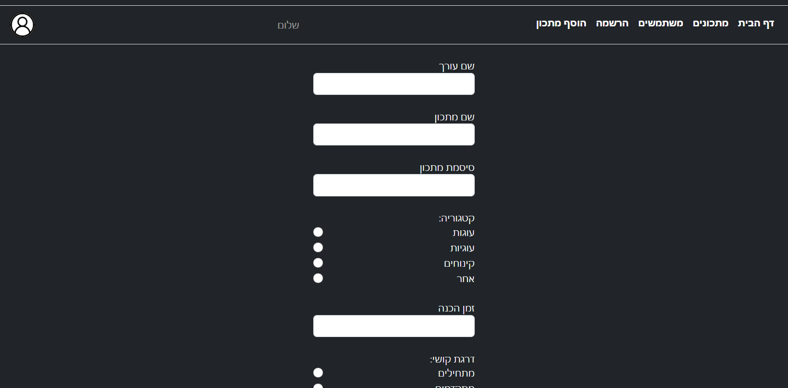

## Full Stack Project: Recipes Site

This project uses Node.js, React, MongoDB, context and Redux to manage recipes and users information. It provides functionalities for:
- Retrieving all recipes
- Adding new recipe
- Retrieving all users
- Adding new user
- And more..


### Prerequisites

- MongoDB (version 5.0.3)
- Node.js (version 20.11.1) with npm
- React development environment (create-react-app recommended)


## Installation

**Cloning the project to your local device:**

In the terminal-
```
   git clone https://github.com/Tamar-Amar/Fullstack-Recipes-Site.git
```

**Backend:**
Make sure you have a compatible database system (MongoDB), Node.js Server and React installed and running.

Installations for backend:  
In the terminal- 
```
   cd Fullstack-Recipes-Site\server
   npm i
```

**Frontend:**

Installations for Frontend:   
In another terminal-
```
   cd Fullstack-Recipes-Site\client
   npm i
```


Database Setup:  
Update the database configuration in app.js to connect to your MongoDB database using the environment variables defined in the .env file.


### Running the Application:
**Backend:**  
Terminal-  
`npm run dev`

**Frontend:**  
Terminal-  
`npm start`

This will start the backend server and the React development server, allowing you to access the application in your browser (usually at http://localhost:3000).

### Attached print screen From Client:
#### Home page- 

#### Add recipe page- 

#### Recipe details-

#### Users list page- 

